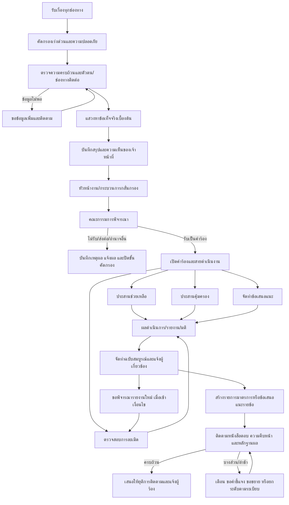
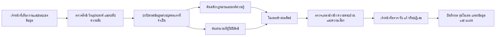

# แบบออกแบบระบบจัดการเรื่องร้องเรียนและติดตามผลโดยมี AI ช่วย

เอกสารฉบับนี้จัดทำจากการศึกษาคู่มือ **“คู่มือด้านการคุ้มครองสิทธิมนุษยชน”** ที่แนบมา ร่วมกับการตรวจสอบโครงสร้างระบบต้นแบบในโครงการ และระเบียบของคณะกรรมการสิทธิมนุษยชนแห่งชาติที่เผยแพร่ในปัจจุบัน เป้าหมายคือใช้เป็นแบบตั้งต้นสำหรับพัฒนาระบบตั้งแต่รับเรื่อง คัดกรอง ดำเนินการ จัดทำรายงาน แจ้งผล ติดตามการเยียวยา จนถึงยุติเรื่อง โดยให้ AI ทำหน้าที่เป็นผู้ช่วยเจ้าหน้าที่ ไม่ใช่ผู้วินิจฉัยแทนมนุษย์

> สถานะเอกสาร: แบบออกแบบเชิงกระบวนงานและระบบ รุ่น 0.1 — ต้องให้เจ้าของกระบวนงาน ฝ่ายกฎหมาย ฝ่ายคุ้มครองข้อมูลส่วนบุคคล และฝ่ายเทคโนโลยีรับรองก่อนใช้จริง

## 1. ข้อสรุปสำคัญจากการศึกษาคู่มือ

คู่มืออธิบายกระบวนงานจริงได้ดี โดยเฉพาะการรับเรื่อง การแสวงหาข้อเท็จจริงเบื้องต้น การประสานช่วยเหลือ/คุ้มครอง การตรวจสอบ การจัดทำรายงาน การแจ้งผล และการติดตามมาตรการหรือข้อเสนอแนะ อย่างไรก็ตาม คู่มืออ้างอิงระเบียบ พ.ศ. 2561 และกำหนดเวลาบางรายการจึงเป็นข้อมูลเดิม

ระเบียบ กสม. ว่าด้วยการตรวจสอบการละเมิดสิทธิมนุษยชนและการจัดทำข้อเสนอแนะ พ.ศ. 2569 ยกเลิกระเบียบ พ.ศ. 2561 และฉบับแก้ไข พ.ศ. 2563, 2564 และ 2565 ดังนั้นระบบใหม่ต้องแยก **ขั้นตอนปฏิบัติงานจากคู่มือ** ออกจาก **กฎและกำหนดเวลาที่ตั้งค่าตามระเบียบปัจจุบัน** และต้องไม่เขียนกำหนดเวลาแบบตายตัวกระจายอยู่ในโปรแกรม

ข้อสังเกตอีกประการคือ สารบัญของคู่มือระบุแผนผัง “การขอให้พิจารณารายงานผลการตรวจสอบใหม่” ที่หน้า 10 แต่ไฟล์แนบกระโดดจากหน้าเอกสาร 9 ไปหน้า 11 จึงควรใช้หมวด 6 ของระเบียบ พ.ศ. 2569 เป็นฐานในการออกแบบส่วนนี้ และขอไฟล์หน้าที่ขาดเพื่อเทียบแนวปฏิบัติภายในภายหลัง

## 2. เป้าหมายของระบบ

1. ทำให้ทุกเรื่องมีเลขอ้างอิง เจ้าของเรื่อง สถานะ เหตุการณ์ เอกสาร และกำหนดเวลาที่ตรวจสอบย้อนหลังได้
2. แยกเรื่องร้องเรียนออกจากคำร้องและสายดำเนินงาน เพื่อรองรับการช่วยเหลือ คุ้มครอง ตรวจสอบ และจัดทำข้อเสนอแนะอย่างถูกต้อง
3. ลดเวลางานเอกสารซ้ำ เช่น ถอดข้อความ สรุปลำดับเหตุการณ์ ตรวจความครบถ้วน ร่างหนังสือ และจัดทำรายงาน
4. ทำให้รายงานทุกข้อค้นพบเชื่อมกลับไปยังพยานหลักฐาน กฎหมาย และหลักสิทธิมนุษยชนที่อ้างอิงได้
5. แจ้งเตือนก่อนพ้นกำหนด รองรับการขยายเวลา และติดตามผลจนได้ผลลัพธ์เชิงเยียวยาหรือการเปลี่ยนแปลง
6. ปกป้องผู้ร้อง ผู้เสียหาย พยาน และข้อมูลอ่อนไหวตามหลักจำเป็นและสิทธิในการเข้าถึง
7. สร้างข้อมูลภาพรวมเพื่อบริหารงาน โดยไม่ใช้ตัวชี้วัดที่จูงใจให้รีบปิดเรื่องมากกว่าคุณภาพการคุ้มครอง

## 3. หลักการออกแบบ

- **Human accountable:** มติ การรับหรือไม่รับคำร้อง การวินิจฉัยว่ามีการละเมิดหรือไม่ ความน่าเชื่อถือของพยาน การกำหนดมาตรการ และการยุติเรื่องเป็นอำนาจของบุคคลหรือคณะบุคคลตามระเบียบเท่านั้น
- **One complaint, multiple tracks:** เรื่องร้องเรียนหนึ่งเรื่องอาจถูกยกระดับเป็นคำร้องและมีหลายสายดำเนินงานพร้อมกันได้
- **Evidence first:** ข้อความในรายงานต้องเชื่อมกับหลักฐานหรือแหล่งกฎหมาย ไม่ให้ AI เติมข้อเท็จจริงที่ไม่มีในสำนวน
- **Rules as data:** กำหนดเวลา วันทำการ ผู้อนุมัติ และเงื่อนไขการขยายเวลาต้องเก็บเป็นชุดกฎที่มีรุ่นและวันที่มีผลใช้
- **Privacy by design:** จำกัดการเปิดเผยชื่อ ที่อยู่ สุขภาพ ชีวมิติ ความพิการ เด็ก พยาน และผู้แจ้งเบาะแสตั้งแต่ระดับข้อมูล ไม่รอปกปิดตอนเผยแพร่
- **Audit by default:** การอ่าน แก้ไข ดาวน์โหลด ส่งต่อ อนุมัติ และใช้ AI ต้องมีร่องรอยตรวจสอบ
- **No silent automation:** AI แนะนำหรือร่างได้ แต่การนำผลไปใช้ต้องเห็นแหล่งอ้างอิง ผู้ตรวจ และรุ่นของผลลัพธ์อย่างชัดเจน

## 4. วัตถุงานหลัก

| วัตถุงาน | ความหมาย | ตัวอย่างสถานะ |
|---|---|---|
| เรื่องร้องเรียน (Complaint) | ข้อมูลที่รับเข้าจากประชาชน หน่วยงาน หรือช่องทางอื่น ก่อนมติรับไว้ดำเนินการ | รับเข้า, ตรวจความครบถ้วน, รอข้อมูลเพิ่ม, จัดทำสรุป, รอพิจารณา, เสร็จการคัดกรอง |
| คำร้อง (Petition) | เรื่องที่คณะกรรมการมีมติรับไว้ดำเนินการตามอำนาจ | เปิดคำร้อง, มอบหมายแล้ว, อยู่ระหว่างดำเนินการ, เสร็จสิ้น |
| สายดำเนินงาน (Track) | งานที่เกิดจากคำร้องหนึ่งเรื่อง | ช่วยเหลือ, คุ้มครอง, ตรวจสอบ, จัดทำข้อเสนอแนะ |
| สำนวน/พยานหลักฐาน | เอกสาร ถ้อยคำ เหตุการณ์ วัตถุ หรือข้อมูลดิจิทัลที่ใช้ประกอบการดำเนินงาน | รับเข้า, ตรวจความสมบูรณ์, รับรองแล้ว, จำกัดการเข้าถึง, ถอน/แทนที่ |
| รายงาน/ข้อเสนอแนะ | เอกสารที่จัดทำจากข้อเท็จจริง กฎหมาย และการวิเคราะห์ | ร่าง, ตรวจ, แก้ไข, เสนอ, เห็นชอบ, ฉบับสมบูรณ์, แจ้งแล้ว |
| มาตรการและการติดตามผล | สิ่งที่บุคคลหรือหน่วยงานต้องดำเนินการ พร้อมกำหนดเวลาและหลักฐานผล | รอเริ่ม, อยู่ระหว่างดำเนินการ, ทำบางส่วน, ทำครบ, ขอขยาย, ไม่ดำเนินการ, ยุติติดตาม |
| คำขอพิจารณาใหม่ | คำขอให้พิจารณารายงานใหม่ตามเงื่อนไขและกำหนดเวลา | รับคำขอ, ตรวจเงื่อนไข, รอพิจารณา, รับไว้, ไม่รับ, จัดทำฉบับใหม่/บันทึกแก้ไข |

การแยกวัตถุเหล่านี้แก้ปัญหาสถานะปะปน เช่น ไม่ควรเปลี่ยนสถานะ “เรื่องร้องเรียน” เป็น “กำลังเขียนรายงาน” เพราะรายงานเป็นงานของสายตรวจสอบ ไม่ใช่สถานะของรายการรับเข้า

## 5. กระบวนงานตั้งแต่รับเรื่องถึงติดตามผล

### 5.1 รับเรื่องและคัดกรองความเร่งด่วน

ระบบต้องรับข้อมูลจากเว็บ แบบฟอร์มเจ้าหน้าที่ โทรศัพท์ อีเมล หนังสือ ช่องทางภาคสนาม และการนำเข้าจากระบบเดิม โดยสร้างเลขรับเรื่องทันที เก็บช่องทาง ต้นฉบับ ความยินยอม ระดับการเปิดเผย และวิธีติดต่อที่ปลอดภัย

ก่อนงานธุรการทั่วไป ต้องมีการประเมินเร่งด่วน เช่น อันตรายต่อชีวิต การควบคุมตัว เด็ก ผู้พิการ ผู้สูงอายุ ความรุนแรงทางเพศ การทรมาน การผลักดันกลับ หรือความเสี่ยงถูกตอบโต้ ระบบสามารถแจ้งเตือนและเสนอคู่มือปฏิบัติได้ แต่เจ้าหน้าที่ต้องเป็นผู้ยืนยันระดับความเสี่ยงและมาตรการฉุกเฉิน

ผลลัพธ์ขั้นต่ำของขั้นนี้:

- เลขรับเรื่องและใบรับเรื่อง
- ข้อมูลผู้ร้อง ผู้เสียหาย ผู้ถูกร้อง และผู้เกี่ยวข้องเท่าที่จำเป็น
- ความประสงค์ของผู้ร้องและวิธีติดต่อที่ปลอดภัย
- ประเด็นเร่งด่วน ผู้รับผิดชอบ และกำหนดตอบสนอง
- เอกสารต้นฉบับแบบไม่ถูกแก้ไข พร้อมค่าแฮชและประวัติการนำเข้า

### 5.2 ตรวจความครบถ้วนและแสวงหาข้อเท็จจริงเบื้องต้น

เจ้าหน้าที่ตรวจความชัดเจน ความเกี่ยวข้องกับอำนาจหน้าที่ ความน่าเชื่อถือเบื้องต้น ข้อมูลที่ขาด และเรื่องซ้ำ จากนั้นแสวงหาข้อเท็จจริงด้วยการขอเอกสาร ติดต่อผู้ร้อง สอบถามหน่วยงาน ค้นฐานข้อมูล หรือออกพื้นที่ตามความเหมาะสม

ระบบควรสร้างรายการตรวจตามแบบของคณะกรรมการ และแสดงนาฬิกากำหนดเวลาแยกกรณีปกติกับกรณีที่ต้องแสวงหาข้อเท็จจริงเพิ่ม โดยกฎปัจจุบันกำหนดให้เสนอบันทึกสรุปภายใน 15 วันนับแต่ได้รับมอบหมาย หรือ 45 วันเมื่อจำเป็นต้องแสวงหาข้อเท็จจริงหรือพยานหลักฐานให้เพียงพอ

AI ช่วยได้โดย:

- ถอดข้อความจากเสียง ภาพสแกน และเอกสาร พร้อมให้เจ้าหน้าที่ตรวจเทียบต้นฉบับ
- จัดโครงเรื่อง ใคร-ทำอะไร-ที่ไหน-เมื่อใด-ผลกระทบ-ความประสงค์ โดยไม่แก้เนื้อหาต้นฉบับ
- ตรวจช่องข้อมูลที่ขาดและเสนอคำถามติดตาม
- เสนอเรื่องที่อาจซ้ำหรือเกี่ยวเนื่อง พร้อมอธิบายเหตุผลและคะแนนความคล้าย
- สร้างลำดับเหตุการณ์เบื้องต้นและแยก “ข้อกล่าวอ้าง” ออกจาก “ข้อเท็จจริงที่มีหลักฐานรองรับ”
- ค้นหลักสิทธิมนุษยชน กฎหมาย ระเบียบ และกรณีศึกษาจากคลัง RAG พร้อมอ้างหน้า/ข้อ

### 5.3 จัดทำบันทึกสรุป กลั่นกรอง และมติ

บันทึกสรุปต้องมีอย่างน้อยชื่อผู้ร้องและผู้ถูกร้อง สรุปข้อเท็จจริง ความประสงค์ และความเห็นของเจ้าหน้าที่พร้อมเหตุผล ระบบต้องรองรับการตรวจโดยหัวหน้างาน การกลั่นกรอง (หากคณะกรรมการกำหนด) การบรรจุวาระ เอกสารประกอบ มติ และความเห็นแย้ง

ผลมติต้องเลือกจากรายการที่กำหนดและสร้างงานต่อโดยอัตโนมัติ เช่น:

- รับเป็นคำร้องเพื่อประสานช่วยเหลือ
- รับเป็นคำร้องเพื่อประสานคุ้มครอง
- รับเป็นคำร้องเพื่อตรวจสอบการละเมิด
- รับเป็นคำร้องเพื่อจัดทำข้อเสนอแนะ
- ไม่รับเป็นคำร้อง พร้อมฐานและเหตุผล
- ส่งต่อหรือดำเนินการตามอำนาจหน้าที่อื่น

ระบบสร้างหนังสือแจ้งผลจากมติได้ แต่ต้องให้ผู้มีอำนาจตรวจและอนุมัติก่อนส่ง พร้อมเก็บหลักฐานการส่งและการรับ

### 5.4 เปิดคำร้อง มอบหมาย และวางแผน

เมื่อรับเป็นคำร้อง ระบบสร้างเลขคำร้องและสายดำเนินงานตามมติ ระบุผู้กำกับดูแล เจ้าหน้าที่ผู้รับผิดชอบ ผู้ร่วมดำเนินการ ประเด็นที่จะตรวจ แผนพยานหลักฐาน ผู้เกี่ยวข้อง ความเสี่ยง และกำหนดเวลา

ก่อนรับมอบหมาย ระบบตรวจความขัดกันแห่งผลประโยชน์และให้เจ้าหน้าที่รับรอง หากมีเหตุถอนตัวหรือเปลี่ยนผู้รับผิดชอบต้องเก็บเหตุผลและประวัติ

AI ช่วยเสนอแผนงานได้ เช่น ประเด็นพิสูจน์ แหล่งหลักฐาน บุคคลที่ควรรับฟัง ลำดับคำถาม และกฎหมายที่เกี่ยวข้อง แต่เจ้าหน้าที่ต้องเลือกและอนุมัติแผน

### 5.5 ประสานช่วยเหลือและประสานคุ้มครอง

พื้นที่ทำงานสายช่วยเหลือ/คุ้มครองต้องมี:

- เป้าหมายการช่วยเหลือหรือความเสี่ยงที่ต้องลด
- หน่วยงานและผู้ประสานงาน
- บันทึกการติดต่อ หนังสือ และคำตอบทุกครั้ง
- ความยินยอมของผู้ร้อง/ผู้เสียหายและข้อจำกัดการเปิดเผย
- มาตรการชั่วคราว ผลลัพธ์ และหลักฐานว่าความเสี่ยงลดลงหรือยัง
- การแจ้งผู้ร้องและการส่งต่อไปสายตรวจสอบเมื่อพบมูลหรือจำเป็น

AI ช่วยสรุปประวัติการประสาน ร่างหนังสือที่ไม่เปิดเผยข้อมูลเกินจำเป็น เปรียบเทียบคำตอบกับสิ่งที่ร้องขอ และเตือนประเด็นที่ยังไม่ได้รับการตอบ แต่ห้ามติดต่อบุคคลภายนอกเอง

### 5.6 ตรวจสอบการละเมิดสิทธิมนุษยชน

ระบบต้องรองรับการตรวจคำร้องเดี่ยวและคำร้องที่พิจารณารวมกัน การขอคำชี้แจง/เอกสาร การรับฟังถ้อยคำ การนัดหมาย การลงพื้นที่ ผู้เชี่ยวชาญ การไต่สวนสาธารณะ การเก็บรักษาหลักฐาน และการใช้มาตรการพิเศษตามกฎหมาย

องค์ประกอบสำคัญคือ “ตารางพยานหลักฐาน” ที่เชื่อมแต่ละข้อกล่าวอ้างกับ:

- ประเด็นที่ต้องพิสูจน์
- หลักฐานสนับสนุนและหลักฐานโต้แย้ง
- แหล่งที่มา วันได้รับ ผู้จัดเก็บ และระดับความลับ
- ความเห็นของคู่กรณี
- กฎหมาย/หลักสิทธิมนุษยชนที่เกี่ยวข้อง
- ช่องว่างหรือความขัดแย้งที่ยังต้องตรวจเพิ่ม

กำหนดเวลาปัจจุบันสำหรับการตรวจสอบคือ 90 วันนับแต่ได้รับมอบหมาย ส่วนคำร้องซับซ้อนให้เป็นไปตามระยะเวลาที่คณะกรรมการกำหนด ระบบจึงต้องรองรับการเสนอเหตุผล กำหนดใหม่ ผู้อนุมัติ และประวัติการเปลี่ยนแปลง ไม่ใช่เพียงแก้วันที่ครบกำหนดเดิม

AI ช่วยได้โดยสร้างลำดับเหตุการณ์จากเอกสารที่เลือก สรุปถ้อยคำ เปรียบเทียบคำให้การ ตรวจความขัดแย้ง สร้างคำถามติดตาม และแนะนำเอกสารที่น่าจะเกี่ยวข้องจากสำนวน ทั้งหมดต้องแสดงลิงก์กลับต้นฉบับ

### 5.7 จัดทำรายงาน ตรวจทาน และมีมติ

ระบบเขียนรายงานควรแบ่งเป็นส่วนที่มีโครงสร้าง ได้แก่ คู่กรณี ความเป็นมา ข้อกล่าวอ้าง วิธีตรวจสอบ ข้อเท็จจริงที่รับฟัง กฎหมายและหลักสิทธิมนุษยชน การวิเคราะห์ ความเห็น มาตรการเยียวยา/ป้องกัน หน่วยงานผู้รับผิดชอบ วิธีดำเนินการ และกำหนดเวลา

ทุกย่อหน้าสำคัญควรผูกกับหลักฐานหรือแหล่ง RAG และมีสถานะว่า “ร่างโดย AI”, “เจ้าหน้าที่แก้ไข”, “ตรวจแล้ว” หรือ “รับรองแล้ว” ระบบต้องเก็บทุกรุ่น เปรียบเทียบการแก้ไข ความเห็นของผู้ตรวจ และผู้อนุมัติ

ตามระเบียบปัจจุบัน เมื่อการตรวจสอบเสร็จ เจ้าหน้าที่จัดทำรายงานเสนอภายใน 30 วัน เมื่อคณะกรรมการเห็นชอบให้จัดทำฉบับสมบูรณ์ภายใน 15 วัน และแจ้งผลพร้อมรายงานภายใน 10 วันหลังจัดทำฉบับสมบูรณ์เสร็จ

AI ช่วยร่างจากข้อมูลที่เจ้าหน้าที่เลือก ตรวจความครบถ้วน ตรวจว่าข้อสรุปมีหลักฐานรองรับ ตรวจเลขข้อ/การอ้างอิง และเสนอข้อความปกปิดข้อมูลสำหรับฉบับเผยแพร่ได้ แต่ห้ามตัดสินว่ามีการละเมิดหรือไม่มีการละเมิด

### 5.8 จัดทำข้อเสนอแนะเชิงระบบ

สายข้อเสนอแนะควรรองรับขั้นตอนจากคู่มือ ได้แก่ รวบรวมข้อเท็จจริงและกฎหมาย วิเคราะห์ปัญหา ศึกษาพันธกรณีและแนวปฏิบัติเปรียบเทียบ ปรึกษากรรมการ จัดเวที/สัมภาษณ์ผู้มีส่วนได้เสีย สังเคราะห์ข้อเสนอแนะ แยกมาตรการเชิงบริหารกับการแก้กฎหมาย เสนอพิจารณา จัดทำฉบับสมบูรณ์ แจ้งหน่วยงาน และติดตามผล

ระเบียบปัจจุบันกำหนดจัดทำข้อเสนอแนะภายใน 90 วัน หรือ 180 วันสำหรับคำร้องซับซ้อน และจัดทำฉบับสมบูรณ์ภายใน 15 วันหลังมีมติเห็นชอบ

ระบบต้องเก็บ “ข้อเสนอแนะรายข้อ” ไม่ใช่เพียงไฟล์รายงาน เพราะแต่ละข้ออาจมีผู้รับผิดชอบ กำหนดเวลา สถานะ และผลลัพธ์ต่างกัน

### 5.9 แจ้งผล เผยแพร่ และปกปิดข้อมูล

การแจ้งผู้ร้อง หน่วยงาน ผู้เกี่ยวข้อง และการเผยแพร่สู่สาธารณะต้องเป็นคนละกระบวนการ ระบบต้องมีแม่แบบหนังสือ รายชื่อผู้รับ ช่องทางส่ง วันที่ส่ง วันที่รับ และหลักฐานการรับ

ก่อนเผยแพร่ต้องผ่านลำดับ:

1. เลือกเอกสารฉบับที่ได้รับอนุมัติแล้วเท่านั้น
2. ตรวจข้อมูลส่วนบุคคลและความเสี่ยงต่อผู้ร้อง ผู้เสียหาย พยาน เด็ก และบุคคลเปราะบาง
3. สร้างฉบับปกปิดข้อมูลโดยไม่แก้ต้นฉบับ
4. ให้เจ้าหน้าที่คุ้มครองข้อมูลและผู้มีอำนาจอนุมัติ
5. เผยแพร่เอกสารสาธารณะและนำเฉพาะฉบับนี้เข้า RAG สาธารณะ

ห้ามนำสำนวน หลักฐานดิบ ร่างรายงาน หรือข้อมูลคดีลับเข้า index ที่ผู้ใช้ทั่วไปค้นได้

### 5.10 ติดตามมาตรการและข้อเสนอแนะ

เมื่อรายงานหรือข้อเสนอแนะได้รับอนุมัติ ระบบต้องแปลงข้อความเป็นรายการติดตามรายข้อ โดยเจ้าหน้าที่ตรวจยืนยัน:

- เนื้อหามาตรการ/ข้อเสนอแนะ
- บุคคลหรือหน่วยงานรับผิดชอบ
- กฎหมายหรือฐานอำนาจ
- วิธีการและผลที่คาดหวัง
- วันที่เริ่มและครบกำหนด
- หลักฐานที่ใช้ยืนยันผล
- ผู้ติดตามและระดับการยกระดับเมื่อไม่ดำเนินการ

ศูนย์ติดตามผลต้องรับหนังสือตอบและจำแนกเป็น ยังไม่เริ่ม/อยู่ระหว่างดำเนินการ/ทำบางส่วน/ทำครบ/ไม่อาจดำเนินการ/ขอขยาย/ไม่ตอบ พร้อมให้เจ้าหน้าที่บันทึกการประเมินและหลักฐาน เมื่อทำครบจึงเสนอผู้มีอำนาจยุติการติดตามและแจ้งผู้ร้อง หากล่าช้าหรือไม่ดำเนินการ ให้ระบบสร้างงานเตือน ขอคำชี้แจง เสนอขยายเวลา หรือยกระดับไปยังหน่วยกำกับ/กลไกตามระเบียบปัจจุบัน

AI ช่วยอ่านหนังสือตอบ แยกผลตามข้อเสนอแนะ เปรียบเทียบคำกล่าวอ้างกับหลักฐาน ระบุส่วนที่ยังขาด และร่างสรุปความก้าวหน้า แต่สถานะ “ทำครบ” และ “ยุติการติดตาม” ต้องได้รับการยืนยันโดยมนุษย์

### 5.11 การขอพิจารณารายงานใหม่

ระบบต้องรับคำขอ ตรวจผู้มีสิทธิ เหตุแห่งคำขอ หลักฐานใหม่ และกำหนดเวลา ระเบียบ พ.ศ. 2569 กำหนดให้ยื่นภายใน 90 วันนับแต่รู้หรือควรรู้ถึงเหตุ แต่ไม่เกินหนึ่งปีนับแต่มีเหตุ และให้สำนักงานเสนอคณะกรรมการภายใน 15 วันนับแต่ได้รับคำขอ

หากรับไว้ ระบบเปิดงานตรวจเฉพาะประเด็นที่กำหนด โดยเชื่อมกับรายงานเดิม หากผลเปลี่ยนสาระสำคัญให้สร้างรายงานฉบับใหม่และยกเลิกฉบับเดิมตามมติ หากไม่เปลี่ยนสาระสำคัญให้ทำบันทึกแก้ไขแนบท้าย ทั้งสองกรณีต้องรักษาประวัติและลิงก์ระหว่างฉบับ

## 6. เครื่องยนต์กำหนดเวลา

ระบบควรมีตารางชุดกฎอย่างน้อยดังนี้:

| ฟิลด์ | ตัวอย่าง |
|---|---|
| ชื่อกฎ | เสนอบันทึกสรุปกรณีปกติ |
| แหล่งกฎหมาย | ระเบียบ กสม. พ.ศ. 2569 ข้อ 18 |
| วันที่เริ่ม/สิ้นผลใช้ | เพื่อรองรับการเปลี่ยนระเบียบและคดีค้าง |
| เหตุเริ่มนับ | วันที่ได้รับมอบหมาย |
| จำนวนและหน่วย | 15 วัน |
| ปฏิทิน | วันปฏิทิน/วันทำการตามกฎที่รับรอง |
| เงื่อนไข | ปกติ หรือ ต้องแสวงหาข้อมูลเพิ่ม |
| ผู้อนุมัติการขยาย | คณะกรรมการ/ผู้มีอำนาจตามข้อกำหนด |
| การเตือน | ก่อนครบ 14, 7, 3, 1 วัน และเมื่อเกินกำหนด |

ชุดกฎตั้งต้นที่ต้องยืนยันก่อนขึ้นระบบจริง:

| เหตุการณ์ | ระยะเวลาตามระเบียบ พ.ศ. 2569 |
|---|---:|
| เสนอบันทึกสรุปหลังรับมอบหมาย | 15 วัน |
| กรณีต้องแสวงหาข้อเท็จจริง/หลักฐานเพิ่ม | 45 วัน |
| แจ้งผู้ร้องหลังมติคัดกรองหรือมติประสาน | 15 วัน |
| ตรวจสอบการละเมิด | 90 วัน หรือระยะเวลาที่คณะกรรมการกำหนดสำหรับเรื่องซับซ้อน |
| ให้เวลาชี้แจงเป็นหนังสือ | ไม่น้อยกว่า 7 วันนับแต่ได้รับหนังสือ |
| จัดทำรายงานหลังตรวจสอบเสร็จ | 30 วัน |
| จัดทำรายงานฉบับสมบูรณ์หลังมติเห็นชอบ | 15 วัน |
| แจ้งผลหลังจัดทำฉบับสมบูรณ์ | 10 วัน |
| จัดทำข้อเสนอแนะ | 90 วัน; เรื่องซับซ้อน 180 วัน |
| จัดทำข้อเสนอแนะฉบับสมบูรณ์ | 15 วันหลังมติเห็นชอบ |
| เสนอคำขอพิจารณาใหม่ต่อคณะกรรมการ | 15 วันหลังรับคำขอ |

กำหนดเวลาของมาตรการเยียวยาและการติดตามผลต้องดึงจากรายงาน/มติและระเบียบติดตามผล พ.ศ. 2568 เป็นรายกรณี ไม่ควรสมมติว่าเป็น 60 หรือ 90 วันทุกเรื่องตามคู่มือเดิม

## 7. บทบาทและสิทธิ

| บทบาท | หน้าที่หลัก | ขอบเขตสำคัญ |
|---|---|---|
| เจ้าหน้าที่รับเรื่อง | บันทึก ตรวจความครบถ้วน ขอข้อมูลเพิ่ม จัดทำสรุป | เห็นเฉพาะเรื่องในหน้าที่และข้อมูลที่จำเป็น |
| หัวหน้ากลุ่ม/ผู้อำนวยการ | มอบหมาย ตรวจคุณภาพ อนุมัติเสนอ | ไม่แก้ต้นฉบับหลักฐาน |
| เจ้าหน้าที่ผู้รับผิดชอบคำร้อง | วางแผน ตรวจสอบ ประสาน จัดทำรายงาน | เข้าถึงตามสำนวนและระดับความลับ |
| ผู้กลั่นกรองรายงาน | ตรวจข้อเท็จจริง เหตุผล กฎหมาย และรูปแบบ | แสดงความคิดเห็น/ขอแก้ไข ไม่เปลี่ยนมติ |
| กรรมการ/คณะกรรมการ | กำกับ พิจารณา และมีมติ | ลงมติพร้อมองค์ประชุมและเอกสารประกอบ |
| เลขานุการประชุม | จัดวาระ บันทึกมติ ส่งงานต่อ | แก้เฉพาะข้อมูลการประชุมที่รับผิดชอบ |
| เจ้าหน้าที่ติดตามผล | แยกข้อเสนอแนะ ติดตาม ประเมินหลักฐาน และเสนอผล | เปลี่ยนสถานะสำคัญผ่านการตรวจรับรอง |
| เจ้าหน้าที่คุ้มครองข้อมูล | ตรวจการเปิดเผยและฉบับปกปิด | เข้าถึงเท่าที่จำเป็นต่อการตรวจ |
| ผู้ตรวจสอบ | อ่านประวัติและรายงาน audit | ไม่มีสิทธิแก้สำนวน |
| ผู้ดูแลระบบ | จัดการบัญชี บทบาท และค่าระบบ | ไม่ได้สิทธิอ่านเนื้อหาคดีโดยอัตโนมัติ |
| ผู้ร้อง | ดูสถานะระดับที่เปิดเผย ส่งข้อมูลเพิ่ม และรับหนังสือ | ไม่เห็นบันทึกภายในหรือข้อมูลบุคคลอื่น |

ต้องมีการควบคุมระดับแถวและระดับเอกสาร รวมถึงการให้สิทธิชั่วคราวที่มีเหตุผล วันหมดอายุ และบันทึกผู้อนุมัติ

## 8. หน้าจอและโมดูลที่ควรมี

1. **ศูนย์รับเรื่อง:** รับข้อมูลทุกช่องทาง OCR/ถอดเสียง ตรวจซ้ำ ออกเลขรับเรื่อง และประเมินเร่งด่วน
2. **โต๊ะคัดกรอง:** รายการข้อมูลขาด การแสวงหาข้อเท็จจริง บันทึกสรุป นาฬิกากำหนดเวลา และตรวจโดยหัวหน้า
3. **ศูนย์มติ:** จัดวาระ เอกสารประกอบ บันทึกมติ เหตุผล ผลคะแนน และสร้างงานต่อ
4. **พื้นที่สำนวน:** ภาพรวมคู่กรณี ประเด็น ลำดับเหตุการณ์ พยานหลักฐาน งานนัดหมาย หนังสือ และ audit trail
5. **ศูนย์ช่วยเหลือ/คุ้มครอง:** ความเสี่ยง ความยินยอม หน่วยงานประสาน มาตรการชั่วคราว และผลลัพธ์
6. **ศูนย์ตรวจสอบ:** แผนตรวจสอบ ตารางพยานหลักฐาน คำชี้แจง ถ้อยคำ การลงพื้นที่ และเรื่องรวม
7. **สตูดิโอรายงาน:** แม่แบบแบบมีโครงสร้าง รุ่นเอกสาร การอ้างอิง การกลั่นกรอง และการเสนออนุมัติ
8. **สตูดิโอข้อเสนอแนะ:** งานวิจัย เวทีผู้มีส่วนได้เสีย ข้อเสนอแนะรายข้อ หน่วยงานรับผิดชอบ และมติ
9. **ศูนย์หนังสือและการแจ้ง:** แม่แบบ ผู้รับ การลงนาม การส่ง หลักฐานรับ และแจ้งเตือนส่งไม่สำเร็จ
10. **ศูนย์ติดตามผล:** ข้อเสนอแนะรายข้อ หนังสือตอบ หลักฐาน สถานะ ขอขยาย การยกระดับ และการยุติ
11. **ศูนย์พิจารณาใหม่:** ตรวจเงื่อนไข กำหนดเวลา ประเด็นที่เปิดใหม่ และการจัดการรายงานฉบับแทนที่
12. **คลังเผยแพร่:** ปกปิดข้อมูล อนุมัติ เผยแพร่ และสร้าง public RAG index
13. **พอร์ทัลผู้ร้อง:** ติดตามสถานะ ส่งข้อมูลเพิ่ม ตั้งค่าช่องทางปลอดภัย รับหนังสือ และประเมินบริการ
14. **แดชบอร์ดผู้บริหาร:** ปริมาณงาน อายุสำนวน ความเสี่ยง กำหนดเวลา ภาระงาน ผลการเยียวยา และปัญหาเชิงระบบ

## 9. แบบข้อมูลที่ควรเพิ่มเติมจากระบบต้นแบบ

ระบบต้นแบบมีแกนสำหรับเรื่องร้องเรียน คู่กรณี ข้อกล่าวอ้าง การมอบหมาย การคัดกรอง กำหนดเวลา เหตุการณ์ หลักฐาน รายงาน รุ่นรายงาน การอ้างอิง AI run และ audit แล้ว แต่ยังต้องเพิ่มแบบข้อมูลสำคัญต่อการทำงานครบวงจร:

- `complaint_sources`, `party_contacts`, `petitions`, `petition_tracks`
- `committee_decisions`, `decision_actions`, `meeting_agendas`, `votes`
- `deadline_rules`, `deadline_extensions`, `notifications`, `delivery_receipts`
- `evidence_requests`, `statements`, `hearings`, `field_visits`, `consents`, `experts`, `case_links`
- `conflict_checks`, `recusals`, `access_grants`
- `recommendation_actions`, `follow_up_updates`, `follow_up_evidence`, `escalations`
- `reconsideration_requests`, `report_replacements`, `report_amendments`
- `publication_reviews`, `redactions`, `public_artifacts`
- `ai_inputs`, `ai_outputs`, `ai_citations`, `ai_feedback`, `model_registry`

เอกสารและหลักฐานควรเก็บในพื้นที่วัตถุที่เข้ารหัส ส่วนฐานข้อมูลเก็บ metadata สิทธิ ค่าแฮช รุ่น และลิงก์ ไม่ควรเก็บไฟล์ขนาดใหญ่เป็นข้อความในตารางหลัก

## 10. สถาปัตยกรรม AI และ RAG

ต้องแยกคลัง RAG อย่างน้อย 3 ชั้น:

1. **คลังสาธารณะ:** กฎหมาย ระเบียบ หลักสิทธิมนุษยชน รายงานที่อนุมัติให้เผยแพร่ และคำวินิจฉัยสาธารณะ
2. **คลังภายใน:** คู่มือ หนังสือเวียน แบบฟอร์ม แนวปฏิบัติ และองค์ความรู้ภายใน
3. **คลังสำนวนจำกัด:** หลักฐานและเอกสารรายคดี แยก tenant/สำนวน/ระดับความลับ และกรองสิทธิก่อนค้นทุกครั้ง

ผลลัพธ์ AI ทุกครั้งต้องเก็บวัตถุประสงค์ ผู้เรียกใช้ รุ่นโมเดล prompt/template ขอบเขตเอกสารที่ค้น แหล่งอ้างอิง คะแนนหรือข้อจำกัด ผลการตรวจของมนุษย์ และการนำไปใช้ โดยมีวงจร `generated → reviewed → accepted / edited / rejected`

### งานที่ AI ทำได้

- OCR ถอดเสียง สรุป และจัดโครงข้อมูล
- ตรวจข้อมูลขาด เรื่องซ้ำ และลำดับเหตุการณ์
- ค้นกฎหมาย/หลักสิทธิ/กรณีใกล้เคียงพร้อมการอ้างอิง
- ร่างคำถาม หนังสือ แผนตรวจสอบ และรายงานจากข้อมูลที่เลือก
- สร้างตารางพยานหลักฐานและชี้ความขัดแย้ง
- ตรวจความครบถ้วน การอ้างอิง การใช้ถ้อยคำ และข้อมูลที่ควรปกปิด
- แยกผลการตอบของหน่วยงานตามข้อเสนอแนะและสรุปความคืบหน้า

### งานที่ AI ห้ามทำโดยอัตโนมัติ

- ตัดสินรับหรือไม่รับคำร้อง
- วินิจฉัยว่ามีการละเมิดหรือไม่มีการละเมิด
- ให้คะแนนความน่าเชื่อถือสุดท้ายของบุคคล
- เปลี่ยนสายงาน ยุติเรื่อง ขยายเวลา หรือยุติการติดตาม
- แก้หรือลบหลักฐานต้นฉบับ
- ส่งหนังสือ อีเมล หรือข้อความถึงบุคคลภายนอกโดยไม่มีการอนุมัติ
- สร้างข้อเท็จจริงหรือแหล่งอ้างอิงที่ตรวจกลับไม่ได้
- ส่งข้อมูลสำนวนไปบริการภายนอกที่ไม่ได้รับอนุมัติ

## 11. ความมั่นคงปลอดภัยและข้อมูลส่วนบุคคล

ระบบควรแบ่งชั้นข้อมูลเป็น `PUBLIC`, `INTERNAL`, `RESTRICTED`, `HIGHLY_SENSITIVE` และบังคับใช้สิทธิแบบบทบาทร่วมกับความสัมพันธ์ต่อสำนวน โดยมีมาตรการขั้นต่ำ:

- เข้ารหัสขณะส่งและขณะจัดเก็บ แยกกุญแจและหมุนเวียนกุญแจ
- MFA สำหรับเจ้าหน้าที่และ step-up authentication เมื่อดาวน์โหลดหรือเปิดข้อมูลอ่อนไหว
- watermark เอกสาร ดาวน์โหลดแบบมีเหตุผล และจำกัดการส่งต่อ
- บันทึกการอ่าน ค้น ดาวน์โหลด แก้ไข ส่งออก และใช้ AI
- กำหนดอายุข้อมูล การพักการลบเมื่อมีคดี และการทำลายอย่างตรวจสอบได้
- สำรองข้อมูล ทดสอบกู้คืน แผนรับเหตุรั่วไหล และการแจ้งเหตุ
- ประเมินผลกระทบด้านข้อมูลส่วนบุคคลและความเสี่ยง AI ก่อนใช้งานจริง
- ปิดข้อมูลลับใน log, analytics และชุดข้อมูลทดสอบ

## 12. ตัวชี้วัด

ตัวชี้วัดการบริการและประสิทธิภาพ:

- เวลาจากรับเรื่องถึงคัดกรองเร่งด่วนและถึงมอบหมาย
- ร้อยละงานที่เสร็จภายในกำหนด แยกตามขั้นและสายงาน
- จำนวน/อายุเรื่องที่รอข้อมูล รอหน่วยงาน รอพิจารณา และเกินกำหนด
- ภาระงานต่อเจ้าหน้าที่และคอขวดระหว่างหน่วยงาน
- เวลาจัดทำรายงานและจำนวนรอบแก้ไข

ตัวชี้วัดผลลัพธ์และคุณภาพ:

- สัดส่วนมาตรการ/ข้อเสนอแนะที่ทำครบ ทำบางส่วน และไม่ดำเนินการ
- เวลาถึงการคุ้มครองหรือเยียวยาครั้งแรก
- การเกิดซ้ำหรือการยกระดับความเสี่ยงหลังช่วยเหลือ
- ความครบถ้วนของหลักฐานและการอ้างอิงในรายงาน
- อัตราหนังสือส่งสำเร็จและการตอบกลับ
- ความพึงพอใจและความเข้าใจของผู้ร้อง โดยไม่เปิดเผยข้อมูลอ่อนไหว

ตัวชี้วัด AI:

- อัตราที่เจ้าหน้าที่รับ แก้ และปฏิเสธข้อเสนอ AI
- ความถูกต้องของการอ้างอิงและอัตราแหล่งอ้างอิงที่เสีย
- เหตุข้อมูลส่วนบุคคลรั่วหรือผลลัพธ์เกินสิทธิ ต้องเป็นศูนย์
- เวลาที่ลดลงเทียบกับคุณภาพ ไม่วัดเฉพาะจำนวนข้อความที่สร้าง

ไม่ควรใช้ “จำนวนเรื่องปิด” เป็นเป้าหมายเดี่ยว เพราะอาจทำให้ยุติเรื่องเร็วเกินไปหรือหลีกเลี่ยงเรื่องซับซ้อน

## 13. แผนพัฒนา

### ระยะ 0 — รับรองกระบวนงานและกฎ (2–4 สัปดาห์)

- จัด workshop กับสำนักรับเรื่อง สำนักคุ้มครอง/ตรวจสอบ สำนักกฎหมาย สำนักติดตามผล DPO และ IT
- ยืนยันแบบฟอร์ม สถานะ ผู้มีอำนาจ ปฏิทิน กำหนดเวลา และการยกระดับ
- ทำ data classification, threat model และ AI impact assessment
- นำตัวอย่างสำนวนที่ไม่เปิดเผยตัวตนมาทดสอบ 5–10 รูปแบบ

### ระยะ 1 — แกนรับเรื่องและคัดกรอง (6–8 สัปดาห์)

- เรื่องร้องเรียน คู่กรณี เอกสาร ความเร่งด่วน ตรวจครบถ้วน เรื่องซ้ำ และบันทึกสรุป
- เครื่องยนต์กำหนดเวลารุ่นแรก การมอบหมาย สิทธิระดับสำนวน และ audit
- AI ถอดข้อความ สรุปข้อมูลขาด ลำดับเหตุการณ์ และ RAG กฎหมาย
- มติคัดกรอง หนังสือแจ้ง และหลักฐานการส่ง

### ระยะ 2 — คำร้องและการดำเนินงาน (8–12 สัปดาห์)

- คำร้อง/หลายสายงาน ศูนย์ช่วยเหลือ/คุ้มครอง และพื้นที่ตรวจสอบ
- คำขอเอกสาร ถ้อยคำ นัดหมาย ลงพื้นที่ ผู้เชี่ยวชาญ และตารางพยานหลักฐาน
- สตูดิโอรายงาน รุ่นเอกสาร การกลั่นกรอง และมติ
- AI ร่างเอกสารจากข้อมูลที่เลือก ตรวจอ้างอิง และตรวจข้อมูลส่วนบุคคล

### ระยะ 3 — ติดตามผลและพอร์ทัล (6–10 สัปดาห์)

- มาตรการ/ข้อเสนอแนะรายข้อ หนังสือตอบ หลักฐาน ขอขยาย และการยกระดับ
- ศูนย์พิจารณาใหม่ พอร์ทัลผู้ร้อง และการแจ้งเตือนหลายช่องทาง
- แดชบอร์ดผลลัพธ์และรายงานผู้บริหาร

### ระยะ 4 — ข้อเสนอแนะเชิงระบบและเผยแพร่ (6–8 สัปดาห์)

- สตูดิโอข้อเสนอแนะ เวทีผู้มีส่วนได้เสีย และการติดตามเชิงนโยบาย
- กระบวนการปกปิด อนุมัติเผยแพร่ และ public RAG
- ทดสอบเจาะระบบ ทดสอบกู้คืน ตรวจความเป็นธรรม/ความแม่นของ AI และนำร่องจริง

## 14. เกณฑ์รับมอบขั้นต่ำ

- สร้างเรื่อง รับเอกสาร ประเมินเร่งด่วน และออกเลขอ้างอิงได้ทุกช่องทางที่ตกลง
- เส้นตายถูกสร้างจากเหตุการณ์ตามชุดกฎ มีการเตือน ขยาย และ audit ได้
- มติหนึ่งครั้งสามารถเปิดคำร้องและหลายสายงานโดยไม่ทำให้ข้อมูลซ้ำ
- ทุกข้อเท็จจริงและข้อสรุปในร่างรายงานเปิดกลับไปยังหลักฐาน/แหล่งอ้างอิงได้
- ผู้ไม่มีสิทธิไม่สามารถค้นผ่าน UI, API หรือ RAG เพื่อพบข้อมูลสำนวนได้
- AI ไม่สามารถส่งออก อนุมัติ เปลี่ยนสถานะสำคัญ หรือแก้หลักฐานเอง
- มาตรการและข้อเสนอแนะถูกติดตามรายข้อจนมีหลักฐานผลและมติยุติ
- รายงานฉบับสาธารณะไม่ปะปนกับฉบับภายในและผ่านการอนุมัติปกปิด
- กู้คืนข้อมูลจากสำรองและสร้างรายงาน audit สำหรับเหตุการณ์สำคัญได้
- ผ่านการทดสอบผู้ใช้จริงของเจ้าหน้าที่แต่ละบทบาทและผู้ร้องกลุ่มเปราะบาง

## 15. ช่องว่างของระบบต้นแบบและลำดับเร่งด่วน

ระบบต้นแบบปัจจุบันมีหน้า Dashboard, รับเรื่อง, Case Workspace, หลักฐาน, รายงาน, RAG และโครงสร้าง audit/สิทธิพื้นฐานแล้ว จึงควรต่อยอดตามลำดับ:

**P0 — จำเป็นก่อนนำร่อง:** แยก Complaint/Petition/Track, เครื่องยนต์กฎแบบมีรุ่น, มติและงานต่อ, การแจ้ง/หลักฐานรับ, การขยายเวลา, ศูนย์ติดตามผลรายข้อ และสิทธิระดับสำนวน/RAG

**P1 — จำเป็นต่อการทำงานจริง:** ศูนย์ช่วยเหลือ/คุ้มครอง, หนังสือขอข้อมูล, ถ้อยคำ, นัดหมาย, ลงพื้นที่, consent, conflict check, ตารางพยานหลักฐาน และ workflow กลั่นกรองรายงาน

**P2 — ครบวงจร:** สตูดิโอข้อเสนอแนะ, ขอพิจารณาใหม่, ปกปิด/เผยแพร่, พอร์ทัลผู้ร้อง, e-signature และ dashboard ผลลัพธ์

## 16. ประเด็นที่ต้องยืนยันกับเจ้าของกระบวนงาน

1. แบบฟอร์มและเลขทะเบียนที่ใช้อยู่จริง รวมถึงการเชื่อมสารบรรณ
2. หลักนับวันปฏิทิน/วันทำการ วันหยุด และผู้มีอำนาจขยายในแต่ละขั้น
3. โครงสร้างคณะกลั่นกรองและผู้กำกับดูแลภายใต้ระเบียบ พ.ศ. 2569
4. นิยามคำร้องซับซ้อนและขั้นตอนกำหนดระยะเวลาเฉพาะ
5. แนวปฏิบัติช่วยเหลือ/คุ้มครองกรณีฉุกเฉินและการขอความยินยอม
6. ขั้นการยกระดับเมื่อหน่วยงานไม่ตอบหรือไม่ทำตามระเบียบติดตามผล พ.ศ. 2568
7. เนื้อหาหน้า 10 ที่ขาดจากคู่มือแนบ และแนวปฏิบัติการพิจารณาใหม่ภายใน
8. ระบบภายนอกที่จะเชื่อม เช่น สารบรรณ e-signature SMS/email/LINE หน่วยงาน และระบบประชุม
9. สถานที่ติดตั้งโมเดล AI ข้อห้ามส่งข้อมูลออกนอกองค์กร และบัญชีโมเดลที่อนุมัติ
10. นโยบายเก็บรักษา เปิดเผย และทำลายข้อมูลแยกตามชนิดสำนวน

## 17. แหล่งอ้างอิงหลัก

- คู่มือด้านการคุ้มครองสิทธิมนุษยชน ฉบับไฟล์แนบ `คู่มือคุ้มครอง.pdf` จำนวน 17 หน้า
- [ระเบียบ กสม. และรายการฉบับปัจจุบัน](https://www.nhrc.or.th/th/nhrc-regulations)
- [ระเบียบ กสม. ว่าด้วยการตรวจสอบการละเมิดสิทธิมนุษยชนและการจัดทำข้อเสนอแนะ พ.ศ. 2569](https://static.nhrc.or.th/file/content/pdf/46901/%E0%B8%A3%E0%B8%B0%E0%B9%80%E0%B8%9A%E0%B8%B5%E0%B8%A2%E0%B8%9A%20%E0%B8%81%E0%B8%AA%E0%B8%A1.%20%E0%B8%A7%E0%B9%88%E0%B8%B2%E0%B8%94%E0%B9%89%E0%B8%A7%E0%B8%A2%E0%B8%81%E0%B8%B2%E0%B8%A3%E0%B8%95%E0%B8%A3%E0%B8%A7%E0%B8%88%E0%B8%AA%E0%B8%AD%E0%B8%9A%E0%B8%AF%20%E0%B8%9E.%E0%B8%A8.%202569.pdf)
- [ระเบียบ กสม. ว่าด้วยการติดตามผลการดำเนินการด้านสิทธิมนุษยชน พ.ศ. 2568](https://www.nhrc.or.th/th/nhrc-regulations/16470)
- แบบระบบเดิมในโครงการ: `docs/NHRC_COMPLAINT_SYSTEM_BLUEPRINT.md` และ `supabase/case_management.sql`

เอกสารนี้เป็นแบบออกแบบระบบ ไม่ใช่ความเห็นทางกฎหมาย กำหนดเวลา แบบฟอร์ม และอำนาจอนุมัติทุกข้อควรได้รับการรับรองจากหน่วยงานเจ้าของเรื่องก่อนตั้งค่าในระบบใช้งานจริง
