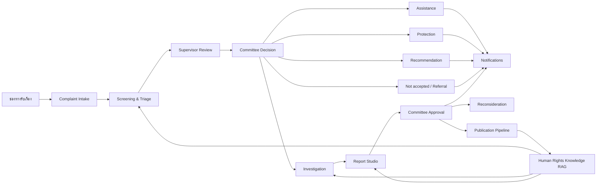
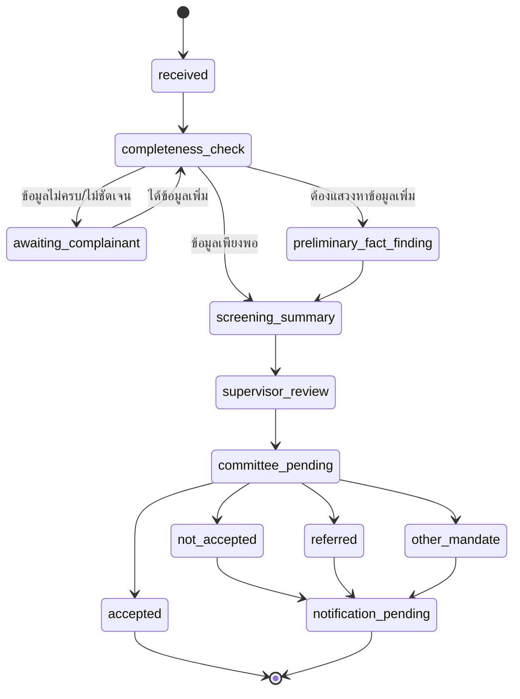

# Blueprint ระบบจัดการและกลั่นกรองเรื่องร้องเรียน กสม.

สถานะเอกสาร: ร่างสถาปัตยกรรมสำหรับหารือและยืนยันกับผู้ปฏิบัติงาน  
ฉบับ: 0.1 — 14 กรกฎาคม 2569  
ฐานระเบียบ: ระเบียบคณะกรรมการสิทธิมนุษยชนแห่งชาติว่าด้วยการตรวจสอบการละเมิดสิทธิมนุษยชนและการจัดทำข้อเสนอแนะ พ.ศ. 2569

> เอกสารนี้เป็นแบบระบบและการแปลงข้อกำหนดเป็นกระบวนงาน ไม่ใช่คำวินิจฉัยหรือคำแนะนำทางกฎหมาย ก่อนพัฒนาใช้งานจริงต้องยืนยันแบบ คำสั่ง แนวปฏิบัติ มติ และรายละเอียดที่คณะกรรมการกำหนดเพิ่มเติมตามระเบียบ

## 1. เป้าหมายของระบบ

สร้างระบบงานภายในที่ช่วยให้สำนักงาน กสม. สามารถ:

1. รับเรื่องร้องเรียนจากทุกช่องทางและรักษาข้อมูลต้นทางครบถ้วน
2. ตรวจความครบถ้วน แสวงหาข้อเท็จจริงเบื้องต้น และกลั่นกรองเรื่องภายในกรอบเวลา
3. จัดทำบันทึกสรุปและความเห็นเพื่อเสนอคณะกรรมการ โดยแยกข้อเท็จจริงออกจากความเห็นอย่างชัดเจน
4. บันทึกมติคณะกรรมการและเปลี่ยนสถานะงานโดยมีฐานอำนาจและร่องรอยตรวจสอบ
5. บริหารคำร้องในเส้นทางประสานการช่วยเหลือ ประสานการคุ้มครอง ตรวจสอบ และจัดทำข้อเสนอแนะ
6. บริหารคู่กรณี พยาน หลักฐาน หนังสือ การนัดหมาย การให้ถ้อยคำ และระยะเวลาในสำนวน
7. ช่วยจัดทำ กลั่นกรอง อนุมัติ และจัดเก็บรายงานผลการตรวจสอบทุกฉบับอย่างมี version
8. เชื่อมคลังความรู้เดิมเพื่อค้นกฎหมาย หลักสิทธิมนุษยชน รายงานเดิม และแหล่งอ้างอิง
9. คุ้มครองข้อมูลส่วนบุคคล ข้อมูลอ่อนไหว และความลับของสำนวนตามสิทธิของผู้ใช้
10. ให้ AI เป็นผู้ช่วยวิเคราะห์และร่างเอกสาร โดยไม่แทนที่ดุลพินิจของเจ้าหน้าที่ กรรมการ หรือคณะกรรมการ

## 2. หลักการออกแบบ

### 2.1 แยก “เรื่องร้องเรียน” ออกจาก “คำร้อง”

- `complaint` คือเรื่องที่ได้รับแจ้งหรือร้องเรียนเข้ามาและอยู่ระหว่างตรวจ/กลั่นกรอง
- `petition` หรือ `case` คือเรื่องร้องเรียนที่คณะกรรมการรับไว้ หรือเรื่องที่คณะกรรมการหยิบยกให้ดำเนินการ
- คำร้องต้องเชื่อมกับเส้นทางดำเนินการหนึ่งหรือหลายเส้นทาง ได้แก่
  - `assistance` — ประสานการช่วยเหลือ
  - `protection` — ประสานการคุ้มครองสิทธิมนุษยชน
  - `investigation` — ตรวจสอบการละเมิดสิทธิมนุษยชน
  - `recommendation` — จัดทำข้อเสนอแนะ

ห้ามใช้ status ช่องเดียวแทนทั้งวงจร เพราะคำร้องอาจมีหลายเส้นทางที่อยู่คนละขั้นตอนพร้อมกัน

### 2.2 การตัดสินใจสำคัญต้องมาจากผู้มีอำนาจ

- เจ้าหน้าที่บันทึกข้อเท็จจริง วิเคราะห์ และเสนอความเห็น
- ผู้บังคับบัญชาตรวจ/ให้คำปรึกษาก่อนเสนอคณะกรรมการหรือกรรมการที่กำกับดูแล ตามข้อ 7
- การรับเป็นคำร้อง ไม่รับ ส่งต่อ ยุติ เห็นชอบรายงาน หรือพิจารณาใหม่ ต้องบันทึกเป็นมติหรือการอนุมัติจากผู้มีอำนาจ
- AI ไม่มีสิทธิเปลี่ยนสถานะทางกฎหมายหรือส่งหนังสือออกเอง

### 2.3 ทุกการเปลี่ยนสถานะต้องอธิบายย้อนหลังได้

การเปลี่ยนสถานะต้องเก็บอย่างน้อย:

- สถานะเดิมและสถานะใหม่
- วันเวลา ผู้ดำเนินการ และบทบาท
- เหตุผลและฐานระเบียบ
- เอกสารหรือมติที่รองรับ
- กรณีใช้ AI ให้เชื่อมกับ AI run ที่เกี่ยวข้อง

### 2.4 แยกคลังความรู้สาธารณะออกจากสำนวน

- `public knowledge` เก็บกฎหมาย ระเบียบ หลักสิทธิ รายงานที่เผยแพร่ และเอกสารอ้างอิง
- `restricted case store` เก็บข้อมูลเรื่องร้องเรียน คู่กรณี พยาน หลักฐาน และร่างรายงาน
- ห้ามนำเนื้อหาสำนวนไปเก็บใน `documents` หรือ `document_sections` เดิมโดยอัตโนมัติ
- รายงานฉบับที่ได้รับอนุญาตให้เผยแพร่แล้วเท่านั้นจึงเข้าสู่ publication pipeline และคลังความรู้

## 3. ภาพรวมสถาปัตยกรรม



### 3.1 ขอบเขตระบบหลัก

1. **Case Management** — ระบบสำนวนและ workflow ภายใน
2. **Knowledge Engine** — ระบบ RAG ที่มีอยู่ในปัจจุบัน
3. **Document and Evidence Store** — ที่เก็บไฟล์ private แยกจากเอกสารเผยแพร่
4. **Decision and Meeting Module** — มติ การอนุมัติ วาระ และเอกสารเสนอคณะกรรมการ
5. **Notification Service** — หนังสือแจ้ง การส่ง การรับ และหลักฐานการแจ้ง
6. **Audit and Compliance** — audit log, conflict of interest, access review และ AI log

## 4. กระบวนงานตามระเบียบ

### 4.1 การรับเรื่องร้องเรียน — ข้อ 13–16

ช่องทางที่ต้องรองรับ:

- ยื่นต่อสำนักงานหรือสถานที่ที่กำหนด
- ยื่นต่อกรรมการ
- ไปรษณีย์
- ระบบอิเล็กทรอนิกส์หรือสื่ออื่น
- วาจา
- โทรศัพท์
- เรื่องที่องค์กรอิสระหรือหน่วยงานของรัฐส่งมา
- เรื่องที่คณะกรรมการหยิบยกเอง ตามข้อ 8

ข้อมูลขั้นต่ำสำหรับเรื่องที่ทำเป็นหนังสือ:

- ชื่อและที่อยู่ของผู้ร้อง เมื่อเป็นประโยชน์เฉพาะตัว
- ข้อเท็จจริงและพฤติการณ์ที่กล่าวอ้าง
- ความประสงค์ให้คณะกรรมการดำเนินการ
- ภาษาเอกสาร: ไทย อังกฤษ หรือข้อมูลการแปล

กรณีหน่วยงานอื่นส่งเรื่อง ระบบต้องบันทึกผู้ส่งเป็น `referring_organization` ไม่ใช่ผู้ร้อง และมีขั้นตอนสอบถามความประสงค์ของผู้เสียหายก่อนกำหนดบุคคลนั้นเป็นผู้ร้อง ตามข้อ 13

### 4.2 การตรวจและกลั่นกรองเรื่อง — ข้อ 17–23



ระบบต้องช่วยเจ้าหน้าที่:

- ตรวจว่ามีมูลและอยู่ในหน้าที่และอำนาจหรือไม่
- ทำ checklist ความถูกต้อง ครบถ้วน ชัดเจน และข้อบกพร่องในสาระสำคัญ
- สร้างคำขอแก้ไข คำเชิญมาสอบถาม หรือคำขอเอกสารเพิ่มเติม
- บันทึกการให้คำปรึกษา คำแนะนำ และการติดต่อหน่วยงานเพื่อแก้ไขความเดือดร้อนเร่งด่วน
- สร้างบันทึกสรุปตามข้อ 18 ซึ่งต้องมีผู้ร้อง ผู้ถูกร้อง ข้อเท็จจริง ความประสงค์ ความเห็น และเหตุผล
- เตือนกรอบเวลา 15 วัน หรือ 45 วันเมื่อจำเป็นต้องแสวงหาข้อเท็จจริงเพิ่มเติม

#### รหัสเหตุไม่รับเป็นคำร้องตามข้อ 19

| Code | เหตุ |
|---|---|
| `INSUFFICIENT_FACTS_OR_BASIS` | ข้อเท็จจริงไม่เพียงพอหรือไม่มีมูล |
| `OPINION_OR_IMMATERIAL` | เป็นการแสดงความคิดเห็นหรือไม่เป็นสาระแก่การพิจารณา |
| `RESOLVED_BY_EARLY_ASSISTANCE` | ได้รับการแก้ไขตามข้อ 17 วรรคสามแล้ว |
| `PREVIOUSLY_DECIDED_NO_NEW_FACTS` | เคยพิจารณาแล้วและไม่มีข้อเท็จจริงใหม่ |
| `UNREACHABLE_OR_NO_COOPERATION` | ติดต่อไม่ได้หรือไม่ร่วมมือโดยไม่มีเหตุอันสมควร |
| `WITHDRAWN_OR_VICTIM_DECLINES` | ถอนเรื่องหรือผู้เสียหายไม่ประสงค์ให้ตรวจสอบ |
| `CONDUCT_ENDED_NO_CONTINUING_EFFECT` | พฤติการณ์สิ้นสุดและไม่มีผลหรือการเยียวยาค้างอยู่ |
| `CONCRETE_REMEDIAL_ACTION_UNDERWAY` | เริ่มแก้ไขอย่างเป็นรูปธรรมและมีแนวโน้มเป็นประโยชน์ |
| `ORGANIC_ACT_SECTION_39` | มีลักษณะตามมาตรา 39 |

ต้องบันทึกหลักฐานรองรับเหตุไม่รับ โดยเฉพาะการถอนหรือการไม่ประสงค์ให้ตรวจสอบ และต้องรองรับการส่งต่อหน่วยงานอื่นตามข้อ 20–21

### 4.3 ประสานการช่วยเหลือและคุ้มครอง — ข้อ 24–27

#### Assistance

- ใช้เมื่อยังไม่มีมูลการละเมิด แต่มีเหตุให้ประสานหน่วยงานหรือองค์กรช่วยเหลือ
- บันทึกหน่วยงานผู้รับเรื่อง วันส่ง กำหนดตอบ และผลดำเนินการ
- เมื่อครบกำหนด ให้สร้างงานขอทราบผลและเสนอคณะกรรมการทราบ

#### Protection

- ใช้เมื่อมีมูลการละเมิดและต้องประสานการคุ้มครอง
- ผลลัพธ์ต้องแยกเป็น:
  - แก้ไขแล้วหรือมีกระบวนการแก้ไขที่เหมาะสม
  - ไม่ดำเนินการหรือไม่แจ้งผลในเวลาอันสมควร
- หากมีข้อเสนอแนะ ต้องรองรับรายงานผลการประสานการคุ้มครองสิทธิมนุษยชน
- หลังมติ ต้องแจ้งผู้ร้องภายใน 15 วัน ตามข้อ 27

### 4.4 การตรวจสอบการละเมิด — ข้อ 28–42

#### การมอบหมายและวางแผน

- มอบหมายพนักงานเจ้าหน้าที่ผู้รับผิดชอบคำร้อง
- รองรับผู้ร่วมตรวจสอบหลายคน
- รองรับการรวมคำร้องตามประเด็น ข้อกล่าวอ้าง คู่กรณี หรือความเกี่ยวเนื่อง ตามข้อ 29
- กำหนด investigation plan, issues, allegations, evidence plan และกรอบเวลา
- กรอบมาตรฐาน 90 วันนับแต่ได้รับมอบหมาย ส่วนเรื่องซับซ้อนใช้กำหนดที่คณะกรรมการอนุมัติ

#### การขอคำชี้แจงและหลักฐาน

- สร้างหนังสือที่มีสรุปข้อเท็จจริงเพียงพอต่อการชี้แจง
- กำหนดวันครบกำหนดและรองรับคำขอขยายเวลา
- ติดตามการตอบและหลักฐานการส่ง/รับ
- กรณีไม่ตอบ ต้องมี workflow เสนอว่าใช้หลักฐานเท่าที่มีหรือขอออกคำสั่งตามข้อ 38

#### การให้ถ้อยคำ

- แจ้งนัดล่วงหน้าไม่น้อยกว่า 7 วัน เว้นแต่กรณีเร่งด่วน
- แจ้งสิทธิการชี้แจง สิทธิผู้แทน ล่ามหรือสื่อช่วย สิทธิทนาย/ที่ปรึกษา และข้อ 33
- รองรับผู้แทนที่มีหนังสือมอบอำนาจ
- บันทึกคำเตือนเรื่องการให้ถ้อยคำเท็จตามข้อ 32
- แยก session ของแต่ละฝ่ายและควบคุมผู้เข้าฟัง
- กรณีไม่อนุญาตทนายหรือที่ปรึกษา ต้องบันทึกเหตุผลในสำนวน
- เด็กหรือเยาวชนต้องมีนักจิตวิทยา นักสังคมสงเคราะห์ ผู้ปกครอง หรือบุคคลที่ร้องขอ ตามข้อ 34

#### โทรศัพท์และสื่ออิเล็กทรอนิกส์

บันทึกอย่างน้อย:

- วัน เวลา และช่วงเวลา
- ชื่อและหมายเลขโทรศัพท์หรือช่องทางติดต่อ
- สรุปข้อเท็จจริง
- ชื่อและตำแหน่งผู้รับฟัง
- การแจ้งว่าจะมีการบันทึก
- หลักฐานความยินยอมก่อนบันทึกเสียงหรือภาพและเสียง
- บันทึกที่ส่งให้ผู้ให้ถ้อยคำตรวจสอบและรับรอง

#### เครื่องมือพิเศษ

ระบบต้องรองรับ record และ approval workflow สำหรับ:

- การขอหมายค้นและหนังสือมอบอำนาจ ตามข้อ 36–37
- คำสั่งเรียกให้ดำเนินการตามข้อ 38
- พยานผู้เชี่ยวชาญและผู้ทรงคุณวุฒิ ตามข้อ 39
- ไต่สวนสาธารณะ การรวมคำร้อง ที่ปรึกษา งานวิจัย และกรณีเชิงระบบ ตามข้อ 40
- การร้องทุกข์หรือกล่าวโทษแทนผู้เสียหาย ตามข้อ 41
- การช่วยเหลือเร่งด่วนเมื่อกรรมการพบเห็นหรือได้รับแจ้งข้อเท็จจริงชัดแจ้ง ตามข้อ 42

### 4.5 รายงานผลการตรวจสอบ — ข้อ 43–49

Report Studio ต้องบังคับโครงสร้างอย่างน้อย:

1. ผู้ร้องและผู้ถูกร้อง พร้อม policy การปกปิดชื่อ
2. สรุปเรื่องร้องเรียน ข้อเท็จจริง และความประสงค์
3. พฤติการณ์และสาเหตุของการละเมิด
4. กฎหมายและหลักสิทธิมนุษยชนที่เกี่ยวข้อง พร้อม citation
5. ความเห็นและเหตุผล
6. มาตรการป้องกัน แก้ไข หรือเยียวยา โดยระบุผู้รับผิดชอบ ฐานกฎหมาย วิธีดำเนินการ และกำหนดเวลา

ระบบต้องรองรับทั้งผลว่า “มีการละเมิด” “ไม่มีการละเมิด” และ “ยุติเรื่องระหว่างตรวจสอบ” รวมถึงข้อสังเกตหรือข้อเสนอแนะ

Workflow รายงาน:

```text
investigation_completed
  → report_drafting (30 วัน)
  → supervisor_review
  → optional_report_screening
  → committee_review
  → committee_approved / revision_requested
  → finalization (15 วัน)
  → notification (10 วัน)
  → implementation_follow_up / publication_review
```

กรณีรวมคำร้องต้องรองรับรายงานฉบับเดียวตามข้อ 45 โดยยัง trace กลับไปยังคำร้องต้นทางทุกเรื่องได้

### 4.6 การพิจารณารายงานใหม่ — ข้อ 50–53

- สร้าง reconsideration request แยกจากคำร้องเดิม แต่เชื่อมกับรายงานฉบับที่ขอทบทวน
- เก็บประเภทเหตุ: พยานหลักฐานใหม่ หรือข้อเท็จจริง/ข้อกฎหมายเปลี่ยนแปลงในสาระสำคัญ
- เก็บวันที่ผู้ขอรู้หรือควรรู้ วันที่เกิดเหตุ และตรวจเงื่อนไข 90 วัน/ไม่เกิน 1 ปี
- สำนักงานต้องเสนอคณะกรรมการภายใน 15 วัน
- หากรับ ให้เปิด investigation scope เฉพาะประเด็นที่คณะกรรมการกำหนด
- หากไม่รับ ต้องแจ้งภายใน 15 วัน
- ผลที่เปลี่ยนสาระสำคัญต้องยกเลิกรายงานเดิมและสร้างฉบับใหม่ แต่ห้ามลบประวัติ
- การแก้ที่ไม่เปลี่ยนสาระสำคัญใช้ amendment แนบท้ายรายงาน

### 4.7 การจัดทำข้อเสนอแนะ — ข้อ 54–59

- สร้าง recommendation track และมอบหมายเจ้าหน้าที่
- รองรับกระบวนการกำกับดูแล/กลั่นกรองที่คณะกรรมการกำหนด
- กรอบเวลา 90 วัน หรือ 180 วันสำหรับเรื่องซับซ้อน
- รองรับรายงานหรือหนังสือราชการ
- รองรับไต่สวนสาธารณะ รวมคำร้อง ผู้เชี่ยวชาญ วิจัย และผู้ทรงคุณวุฒิ
- เหตุยุติต้องใช้รหัสตามข้อ 57 และบันทึกมติ
- จัดทำฉบับสมบูรณ์ภายใน 15 วันหลังเห็นชอบ
- แจ้งหน่วยงานที่เกี่ยวข้องและผู้ร้องตามข้อ 59

## 5. Deadline Engine

### 5.1 หลักการ

- Deadline เกิดจาก event ไม่ใช่สร้างด้วยมืออย่างเดียว
- เก็บ `trigger_event`, `triggered_at`, `due_at`, `legal_basis`, `status` และผู้รับผิดชอบ
- ห้าม pause timer อัตโนมัติเพียงเพราะรอข้อมูล หากระเบียบหรือมติไม่ได้กำหนด
- การย่น/ขยายตามข้อ 9 ต้องมีคำขอ เหตุผล ความจำเป็นหรือข้อขัดข้อง มติ และบันทึกในสำนวน
- ระบบเตือนล่วงหน้าและ escalate เมื่อใกล้ครบกำหนดหรือเกินกำหนด
- ต้องยืนยันกับสำนักงานว่า “วัน” ในแต่ละขั้นตอนนับแบบวันปฏิทินหรือมีแนวปฏิบัติอื่น

### 5.2 Deadline มาตรฐาน

| Event | งาน | ระยะเวลา | ฐานระเบียบ |
|---|---|---:|---:|
| เจ้าหน้าที่รับมอบหมายตรวจเรื่อง | เสนอบันทึกสรุป | 15 วัน | ข้อ 18 |
| ต้องแสวงหาข้อมูลเพิ่มเติม | เสนอบันทึกสรุป | 45 วัน | ข้อ 18 |
| คณะกรรมการมีมติเรื่องรับ/ไม่รับ/ส่งต่อ | แจ้งผู้ร้อง | 15 วัน | ข้อ 23 |
| คณะกรรมการมีมติผลการประสาน | แจ้งผู้ร้อง | 15 วัน | ข้อ 27 |
| พนักงานเจ้าหน้าที่รับมอบหมาย | ตรวจสอบให้เสร็จ | 90 วัน | ข้อ 30 |
| นัดให้ถ้อยคำ | แจ้งล่วงหน้า | อย่างน้อย 7 วัน | ข้อ 31 |
| ตรวจสอบเสร็จ | เสนอรายงาน | 30 วัน | ข้อ 43 |
| คณะกรรมการเห็นชอบรายงาน | ทำฉบับสมบูรณ์ | 15 วัน | ข้อ 47 |
| ทำรายงานฉบับสมบูรณ์แล้ว | แจ้งผู้เกี่ยวข้อง | 10 วัน | ข้อ 48 |
| ผู้ขอรู้หรือควรรู้เหตุพิจารณาใหม่ | ยื่นคำขอ | 90 วัน และไม่เกิน 1 ปีนับแต่มีเหตุ | ข้อ 51 |
| สำนักงานได้รับคำขอพิจารณาใหม่ | เสนอคณะกรรมการ | 15 วัน | ข้อ 52 |
| มติไม่รับคำขอพิจารณาใหม่ | แจ้งผู้ขอ | 15 วัน | ข้อ 52 |
| เจ้าหน้าที่รับมอบหมายทำข้อเสนอแนะ | จัดทำข้อเสนอแนะ | 90 วัน | ข้อ 55 |
| คำร้องจัดทำข้อเสนอแนะซับซ้อน | จัดทำข้อเสนอแนะ | 180 วัน | ข้อ 55 |
| คณะกรรมการเห็นชอบข้อเสนอแนะ | ทำฉบับสมบูรณ์ | 15 วัน | ข้อ 58 |

## 6. แบบข้อมูลที่แนะนำ

แนะนำให้สร้าง PostgreSQL schema ใหม่ชื่อ `case_management` และ private storage bucket แยกจากคลังความรู้

### 6.1 ตารางแกนกลาง

| Table | หน้าที่ |
|---|---|
| `complaints` | เรื่องร้องเรียนต้นทาง ช่องทาง ภาษา วันรับ ความประสงค์ และสถานะกลั่นกรอง |
| `complaint_sources` | ผู้ส่ง หน่วยงานอ้างอิง ช่องทาง และข้อมูลต้นทาง |
| `parties` | ผู้ร้อง ผู้เสียหาย ผู้ถูกร้อง พยาน ผู้แทน และหน่วยงานที่เกี่ยวข้อง |
| `party_contacts` | ที่อยู่ โทรศัพท์ อีเมล ช่องทางปลอดภัย และข้อจำกัดการติดต่อ |
| `petitions` | คำร้องที่เกิดจากมติคณะกรรมการหรือการหยิบยก |
| `petition_tracks` | เส้นทาง assistance/protection/investigation/recommendation และสถานะของแต่ละเส้นทาง |
| `allegations` | ข้อกล่าวอ้าง เหตุการณ์ ช่วงเวลา สถานที่ ผู้เกี่ยวข้อง และสิทธิที่อาจถูกกระทบ |
| `rights_issues` | ประเด็นสิทธิและกฎหมายที่เชื่อมกับคลังความรู้ |
| `screening_reviews` | checklist ข้อเท็จจริง เขตอำนาจ มูล และความเห็นพร้อมเหตุผล |
| `assignments` | ผู้รับผิดชอบ ผู้ร่วมดำเนินการ ผู้กำกับดูแล วันที่มอบหมาย |
| `committee_decisions` | มติ วันที่ประชุม วาระ ผล เหตุผล และเอกสารประกอบ |
| `decision_actions` | คำสั่งหรือผลที่ต้องดำเนินการจากมติหนึ่งรายการ |

### 6.2 สำนวนและพยานหลักฐาน

| Table | หน้าที่ |
|---|---|
| `case_documents` | metadata เอกสารในสำนวน ระดับความลับ และไฟล์ต้นทาง |
| `evidence_items` | รายการหลักฐาน ประเภท แหล่งที่มา วันที่ได้มา และสถานะการรับรอง |
| `evidence_versions` | version, checksum, storage key และประวัติการแทนที่ |
| `evidence_requests` | หนังสือขอคำชี้แจง/เอกสาร ผู้รับ วันครบกำหนด และผลตอบ |
| `statements` | บันทึกถ้อยคำ ผู้ให้ถ้อยคำ ผู้รับฟัง วิธีการ และการรับรอง |
| `hearing_sessions` | วันนัด ผู้เข้าร่วม สิทธิที่แจ้ง ล่าม ที่ปรึกษา และผลการนัด |
| `recording_consents` | ความยินยอมบันทึกเสียง/ภาพและขอบเขตความยินยอม |
| `expert_engagements` | ผู้เชี่ยวชาญ/ผู้ทรงคุณวุฒิ ประเด็นที่ขอความเห็น และผล |
| `special_procedures` | หมายค้น คำสั่ง ไต่สวนสาธารณะ วิจัย และการดำเนินการเร่งด่วน |
| `case_links` | ความสัมพันธ์คำร้องซ้ำ เกี่ยวเนื่อง หรือรวมพิจารณา |

### 6.3 เวลา การสื่อสาร และธรรมาภิบาล

| Table | หน้าที่ |
|---|---|
| `deadlines` | trigger, due date, legal basis, owner และสถานะ |
| `deadline_extensions` | คำขอ เหตุผล ระยะเวลาเดิม/ใหม่ มติ และผู้อนุมัติ |
| `notifications` | ผู้รับ ช่องทาง เอกสาร วันส่ง วันรับ และหลักฐานการส่ง |
| `conflict_declarations` | การแจ้งส่วนได้เสีย การคัดค้าน และคำชี้ขาด |
| `recusals` | บุคคลที่ถอนตัว ขอบเขต และการมอบหมายทดแทน |
| `audit_events` | append-only log ของการอ่าน แก้ไข ดาวน์โหลด ส่งออก และเปลี่ยนสถานะ |
| `access_grants` | สิทธิพิเศษรายสำนวนและวันหมดอายุ |

### 6.4 รายงานและการพิจารณาใหม่

| Table | หน้าที่ |
|---|---|
| `reports` | ประเภทรายงาน สถานะ และคำร้องที่เกี่ยวข้อง |
| `report_versions` | ร่างแต่ละฉบับ ผู้จัดทำ เวลา checksum และเหตุการแก้ไข |
| `report_sections` | โครงสร้างรายงานตามข้อ 43 พร้อม citation |
| `report_reviews` | ความเห็นผู้บังคับบัญชา ผู้กลั่นกรอง และกรรมการ |
| `recommendation_actions` | ผู้มีหน้าที่ ฐานกฎหมาย วิธีดำเนินการ และกำหนดเวลา |
| `reconsideration_requests` | ผู้ขอ เหตุ วันที่รู้เหตุ เงื่อนไข และมติ |
| `report_amendments` | การแก้ไขที่ไม่เปลี่ยนสาระสำคัญและเอกสารแนบท้าย |
| `publication_releases` | ขอบเขตการปกปิด ผู้อนุมัติ และ document ID ในคลังความรู้ |

### 6.5 AI และแหล่งอ้างอิง

| Table | หน้าที่ |
|---|---|
| `ai_runs` | ผู้เรียกใช้ วัตถุประสงค์ model/prompt version และสถานะอนุมัติ |
| `ai_run_inputs` | รหัสข้อมูลที่ส่งเข้า hash และระดับความลับ โดยไม่ทำสำเนาเกินจำเป็น |
| `ai_outputs` | ผลลัพธ์ คำเตือน และผู้ยอมรับ/แก้ไข/ปฏิเสธ |
| `citations` | document, section, page, quote span และความเชื่อมโยงกับข้อเสนอ |
| `redaction_jobs` | รายการข้อมูลที่ปกปิด วิธีตรวจ และผู้อนุมัติก่อนส่งออกหรือเผยแพร่ |

## 7. สถานะมาตรฐาน

### 7.1 Complaint status

```text
received
completeness_check
awaiting_complainant
preliminary_fact_finding
screening_summary
supervisor_review
committee_pending
accepted
not_accepted
referred
other_mandate
notification_pending
closed
```

### 7.2 Petition track status

```text
assigned
planning
in_progress
awaiting_external_response
supervisor_review
committee_review
revision_requested
approved
finalizing
notification_pending
follow_up
completed
terminated
```

สถานะต้องมี transition rules และ permission ชัดเจน ห้ามให้ client เปลี่ยน status โดยตรงโดยไม่ผ่านคำสั่งของ workflow service

## 8. บทบาทและสิทธิผู้ใช้

| Role | สิทธิหลัก |
|---|---|
| `intake_officer` | รับเรื่อง แก้ข้อมูลต้นทาง บันทึกการติดต่อ |
| `screening_officer` | ตรวจเรื่อง ขอข้อมูล ทำบันทึกสรุปและความเห็น |
| `supervisor` | ให้คำปรึกษา ตรวจและส่งเรื่องเสนอผู้มีอำนาจ |
| `case_officer` | ดำเนินการคำร้อง หลักฐาน นัดหมาย และร่างรายงาน |
| `report_screener` | กลั่นกรองรายงานและให้ข้อสังเกต โดยไม่แก้หลักฐานต้นทาง |
| `commissioner` | กำกับดูแล ให้ความเห็น และดำเนินการตามมอบหมาย |
| `committee_secretariat` | จัดวาระ บันทึกมติ และออกงานตามมติ |
| `privacy_officer` | ตรวจการปกปิด การเปิดเผย และคำขอเข้าถึงข้อมูล |
| `auditor` | อ่าน audit log และรายงานความผิดปกติแบบ read-only |
| `system_admin` | จัดการระบบ แต่ไม่มีสิทธิอ่านเนื้อหาสำนวนโดยอัตโนมัติ |
| `complainant_portal_user` | ดูเฉพาะสถานะและเอกสารที่อนุญาตของตน |

หลักสิทธิ:

- ใช้ RLS ตาม assignment, supervisory chain, committee scope และ explicit grant
- ผู้ดูแลระบบเทคนิคไม่ควรได้สิทธิอ่านสำนวนจากบทบาทระบบ
- การดาวน์โหลด ส่งออก หรือเปิดดูข้อมูลอ่อนไหวต้องถูกบันทึก
- รองรับ `break-glass access` พร้อมเหตุผล การอนุมัติ และการแจ้งตรวจสอบ

## 9. แผนผังหน้าจอ

### 9.1 Dashboard

- งานของฉัน
- เรื่องใกล้ครบกำหนด/เกินกำหนด
- เรื่องเร่งด่วนและกลุ่มเปราะบาง
- เรื่องรอผู้บังคับบัญชา
- เรื่องรอมติหรือรอจัดวาระ
- ภาระงานตามผู้รับผิดชอบและเส้นทางคำร้อง

### 9.2 Intake Workspace

- เลือกช่องทางรับเรื่อง
- ข้อมูลผู้ร้อง/ผู้เสียหาย/ผู้ทำการแทน
- ผู้ถูกร้องและหน่วยงานที่เกี่ยวข้อง
- เหตุการณ์ ความประสงค์ ภาษา และความต้องการด้านการเข้าถึง
- อัปโหลดเอกสารและบันทึกจากวาจา/โทรศัพท์
- duplicate/similar-case check โดยให้เจ้าหน้าที่ตัดสิน

### 9.3 Screening Workspace

- completeness checklist
- timeline เหตุการณ์
- ประเด็นสิทธิที่ AI เสนอพร้อมหลักฐาน
- jurisdiction and basis checklist
- การขอข้อมูลเพิ่มและ early assistance
- บันทึกสรุปข้อ 18
- ความเห็นรับ/ไม่รับ/ส่งต่อ พร้อม reason code และฐานระเบียบ

### 9.4 Decision Workspace

- สร้างวาระและชุดเอกสารเสนอ
- แสดงความเห็นเจ้าหน้าที่และผู้บังคับบัญชาแยกกัน
- บันทึกมติ ผลโหวตหรือรูปแบบมติตามแนวปฏิบัติ
- สร้าง petition และ tracks จากมติ
- สร้างงานแจ้งผู้ร้องอัตโนมัติ

### 9.5 Investigation Workspace

- investigation plan และประเด็นที่จะตรวจ
- parties/allegations/evidence matrix
- หนังสือขอข้อมูล นัดหมาย และถ้อยคำ
- chronological case timeline
- deadlines และ extension requests
- ผู้เชี่ยวชาญ กระบวนการพิเศษ และการรวมคำร้อง

### 9.6 Report Studio

- โครงรายงานบังคับตามข้อ 43
- evidence-to-finding matrix
- citation จากคลังความรู้และหลักฐานในสำนวน
- แยก “ข้อเท็จจริง” “ข้อกฎหมาย” “การวิเคราะห์” และ “มาตรการ”
- review comments, compare versions และ approval history
- redacted preview ก่อนเผยแพร่

### 9.7 Reconsideration and Recommendation

- ตรวจเงื่อนไขและกรอบเวลาพิจารณาใหม่
- เลือกประเด็นที่จะเปิดตรวจใหม่
- version graph ของรายงานเดิม ฉบับใหม่ และ amendment
- recommendation actions, responsible body, due date และผลติดตาม

## 10. AI Policy

### 10.1 งานที่ AI ช่วยได้

- สรุปเรื่องร้องเรียนโดยแสดงข้อความต้นทางอ้างอิง
- ตรวจรายการข้อมูลที่ยังขาดตามข้อ 14 และแบบที่กำหนด
- สร้าง timeline จากเอกสารโดยให้เจ้าหน้าที่ตรวจ
- เสนอประเด็นสิทธิ ข้อกฎหมาย และคำค้นสำหรับ RAG
- ค้นเรื่องหรือรายงานที่คล้ายกันโดยไม่สรุปว่าเป็นกรณีเดียวกัน
- สร้าง draft หนังสือขอข้อมูล คำถามสัมภาษณ์ และ evidence plan
- ทำ evidence matrix และตรวจความขัดแย้งของข้อความ
- ร่างส่วนต่าง ๆ ของรายงานจากข้อมูลที่ผู้ใช้เลือก
- ตรวจว่า draft report มีองค์ประกอบครบตามข้อ 43
- ตรวจ citation ว่าอ้างถึงเอกสารและเลขหน้าที่มีอยู่จริง
- ช่วยสร้างฉบับปกปิดข้อมูลเพื่อให้ผู้รับผิดชอบตรวจ

### 10.2 งานที่ AI ห้ามทำเอง

- ตัดสินว่ารับหรือไม่รับคำร้อง
- วินิจฉัยว่ามีหรือไม่มีการละเมิด
- ตัดสินความน่าเชื่อถือของผู้ร้อง ผู้ถูกร้อง หรือพยานเป็นผลสุดท้าย
- ยุติเรื่อง เปลี่ยนเส้นทาง หรือขยายเวลา
- แก้ ลบ หรือแทนที่หลักฐานต้นฉบับ
- ติดต่อคู่กรณีหรือส่งหนังสือโดยไม่มีผู้อนุมัติ
- สร้าง citation หรือข้อเท็จจริงที่ไม่มีต้นทาง
- ส่งข้อมูลสำนวนออกนอกระบบโดยไม่ได้ผ่าน policy และการปกปิดข้อมูล

### 10.3 Human-in-the-loop

ทุก AI output ต้องมีสถานะ:

```text
generated → reviewed → accepted / edited / rejected
```

ระบบต้องเก็บผู้ตรวจ เวลา การแก้ไข และเหตุผลเมื่อใช้ผล AI ในเอกสารทางการ

## 11. ความมั่นคงปลอดภัยและข้อมูลส่วนบุคคล

### 11.1 การจัดชั้นข้อมูล

| ชั้น | ตัวอย่าง | การใช้ AI |
|---|---|---|
| `PUBLIC` | กฎหมาย รายงานเผยแพร่ | ใช้กับบริการภายนอกได้ตาม policy |
| `INTERNAL` | คู่มือ ร่างทั่วไป | ใช้ได้เมื่อสัญญาและ policy อนุญาต |
| `RESTRICTED` | เรื่องร้องเรียนและข้อมูลคู่กรณี | ต้องจำกัดผู้ใช้และปกปิดก่อนส่งออก |
| `HIGHLY_SENSITIVE` | เด็ก สุขภาพ ชีวมิติ ความรุนแรงทางเพศ พยานเสี่ยงภัย | ใช้เฉพาะกลไกที่องค์กรอนุมัติเป็นพิเศษ |

### 11.2 ข้อกำหนดขั้นต่ำ

- private bucket แยกสำหรับหลักฐาน พร้อม signed URL อายุสั้น
- encryption at rest และ in transit
- checksum ทุกไฟล์และ version แบบ append-only
- antivirus/malware scanning ก่อนเปิดไฟล์
- RLS และ least privilege
- field-level protection สำหรับข้อมูลติดต่อและข้อมูลอ่อนไหว
- audit log แบบแก้ย้อนหลังไม่ได้
- retention and disposal policy ตามกฎหมายและระเบียบสารบรรณ
- redaction workflow ก่อนแจ้ง ส่งต่อ ส่ง AI หรือเผยแพร่
- backup และ disaster recovery ที่ทดสอบการกู้คืนจริง
- ห้ามนำ secret, ไฟล์สำนวน หรือ embedding ของสำนวนไปปะปนกับ public dataset

## 12. การเชื่อมกับ Human Rights Knowledge RAG ปัจจุบัน

### 12.1 สิ่งที่ใช้ต่อได้

- `documents`, `document_sections` และ semantic search สำหรับเอกสารความรู้
- embeddings และ citation pipeline สำหรับค้นกฎหมาย/รายงานเผยแพร่
- admin import สำหรับจัดการเอกสารอ้างอิง
- Ask AI สำหรับคำถามจากคลังความรู้ โดยต้องแยก prompt และสิทธิจาก Case AI

### 12.2 สิ่งที่ต้องสร้างใหม่

- schema `case_management`
- authentication จริงและ organizational roles แทน shared admin password
- private evidence storage
- workflow/deadline engine
- committee decision module
- case-aware retrieval ที่ตรวจสิทธิรายสำนวน
- report versioning and redaction
- audit, conflict-of-interest และ notification services

### 12.3 Publication pipeline

```text
Approved final report
  → privacy/redaction review
  → publication approval
  → generate public artifact
  → import to documents/document_sections
  → create embeddings
  → publish in Human Rights Knowledge
```

ห้ามเชื่อมรายงานร่างหรือหลักฐานในสำนวนเข้าสู่ public search โดยตรง

## 13. ตัวชี้วัดที่เหมาะสม

ตัวชี้วัดต้องไม่กระตุ้นให้เร่งปิดเรื่องโดยลดคุณภาพ ควรใช้เป็นเครื่องมือบริหารงาน:

- เวลาจากรับเรื่องถึงมอบหมาย
- สัดส่วนบันทึกสรุปภายใน 15/45 วัน
- เวลารอข้อมูลจากผู้ร้องและหน่วยงาน แสดงแยกจากเวลาทำงานภายใน
- จำนวนเรื่องใกล้ครบกำหนดและเกินกำหนด พร้อมเหตุผล
- ภาระงานต่อเจ้าหน้าที่ แยกตามความซับซ้อน
- ระยะเวลาการตรวจสอบและจัดทำรายงาน
- จำนวนคำขอขยายเวลาและเหตุผล
- สัดส่วนรายงานที่ถูกขอแก้ไขหลังกลั่นกรอง
- การแจ้งผลภายในกรอบเวลา
- เหตุการณ์เข้าถึงข้อมูลผิดปกติและ conflict declarations
- อัตราการยอมรับ แก้ไข หรือปฏิเสธ AI output

ไม่ควรใช้ “อัตราวินิจฉัยว่ามีการละเมิด” เป็น KPI ประสิทธิภาพของเจ้าหน้าที่

## 14. แผนพัฒนาเป็นระยะ

### Phase 0 — Policy confirmation

- ยืนยันแบบที่คณะกรรมการกำหนดตามข้อ 16, 18, 31, 35, 36, 38, 43 และข้ออื่น
- ยืนยันแนวปฏิบัติการนับวัน การกลั่นกรอง เรื่องซับซ้อน และการกำกับดูแล
- ทำ data classification, threat model และ AI/data protection assessment

### Phase 1 — Intake and Screening MVP

- รับเรื่องหลายช่องทาง
- parties, documents และ secure storage
- completeness/screening workspace
- deadline 15/45 วัน
- supervisor review, committee decision และ notification
- audit log และ conflict declaration

### Phase 2 — Petition and Investigation

- petition tracks และ assignment
- evidence/request/hearing/statement modules
- deadline 90 วันและ extension workflow
- case consolidation และ expert/special procedure records

### Phase 3 — Report and Decision

- report template ตามข้อ 43
- citations, evidence matrix และ version comparison
- report screening, committee approval, finalization และ notification
- publication/redaction pipeline

### Phase 4 — Recommendation and Reconsideration

- recommendation 90/180 วัน
- reconsideration 90 วัน/1 ปี
- report replacement/amendment graph
- implementation follow-up integration

### Phase 5 — Controlled AI Assistance

- AI summarization and missing-information checks
- RAG legal/reports retrieval
- report drafting with citations
- redaction assistance
- evaluation set, hallucination tests, bias review และ AI audit dashboard

## 15. เกณฑ์รับมอบระบบขั้นต่ำ

ระบบจะถือว่าพร้อมใช้เมื่อ:

1. ทุก transition สำคัญมีผู้มีอำนาจ เหตุผล ฐานระเบียบ และ audit event
2. Deadline ทุกตัวสร้างจาก event ที่ถูกต้องและรองรับ extension ตามข้อ 9
3. ไม่สามารถอ่านสำนวนได้เพียงเพราะเป็น authenticated user
4. ผู้ดูแลระบบเทคนิคไม่มีสิทธิอ่านสำนวนโดยปริยาย
5. หลักฐานทุกไฟล์มี checksum, version และประวัติการเข้าถึง
6. การบันทึกเสียง/ภาพไม่เริ่มก่อนมี consent record
7. รายงานไม่สามารถส่งอนุมัติได้หากองค์ประกอบข้อ 43 ไม่ครบ หรือไม่มีเหตุยกเว้นที่บันทึกไว้
8. AI ไม่สามารถเปลี่ยนสถานะ ส่งหนังสือ หรือเผยแพร่ข้อมูลเอง
9. Citation ทุกจุดเปิดย้อนกลับไปยังเอกสาร section และหน้าได้
10. รายงานที่แก้ไขหรือพิจารณาใหม่รักษาประวัติฉบับเดิมครบถ้วน
11. publication pipeline มี privacy/redaction approval ก่อนเข้าคลังความรู้
12. มีการทดสอบ RLS, audit log, deadline, backup/restore และ unauthorized access

## 16. ประเด็นที่ต้องยืนยันกับผู้ปฏิบัติงานก่อนลงมือพัฒนา

ระเบียบมอบรายละเอียดหลายส่วนให้คณะกรรมการกำหนดเพิ่มเติม จึงต้องรวบรวมเอกสารต่อไปนี้:

1. แบบบันทึกการร้องเรียนด้วยวาจาหรือโทรศัพท์ ตามข้อ 16
2. แบบบันทึกสรุปเรื่องร้องเรียน ตามข้อ 18
3. หลักเกณฑ์กระบวนการกลั่นกรองเรื่องร้องเรียนก่อนคณะกรรมการ
4. เกณฑ์เรื่องซับซ้อนและกรอบเวลาที่คณะกรรมการใช้จริง
5. แบบบันทึกการให้ถ้อยคำและการรับฟังผ่านสื่ออิเล็กทรอนิกส์
6. แบบหนังสือมอบอำนาจขอหมายค้นและแบบคำสั่งตามข้อ 38
7. แบบรายงานผลการตรวจสอบและกระบวนการกลั่นกรองรายงาน
8. หลักเกณฑ์การดำเนินการเร่งด่วนตามข้อ 42
9. หลักเกณฑ์กำกับดูแลและกลั่นกรองข้อเสนอแนะ
10. ระเบียบติดตามผลการดำเนินการด้านสิทธิมนุษยชนที่ต้องเชื่อมต่อ
11. โครงสร้างหน่วยงาน บทบาทจริง สายบังคับบัญชา และการกำกับดูแลของกรรมการ
12. นโยบายชั้นความลับ ระยะเวลาเก็บ และการเปิดเผยข้อมูลในสำนวน

## 17. แหล่งอ้างอิง

- ระเบียบคณะกรรมการสิทธิมนุษยชนแห่งชาติว่าด้วยการตรวจสอบการละเมิดสิทธิมนุษยชนและการจัดทำข้อเสนอแนะ พ.ศ. 2569
- ไฟล์ที่ใช้วิเคราะห์: `C:\Users\tongd\Downloads\ระเบียบ กสม. ว่าด้วยการตรวจสอบฯ พ.ศ. 2569.pdf`
- หน้าเผยแพร่ของสำนักงาน กสม.: https://www.nhrc.or.th/th/nhrc-regulations/16982
- ราชกิจจานุเบกษา เล่ม 143 ตอนที่ 31 ก หน้า 22 วันที่ 14 พฤษภาคม 2569

